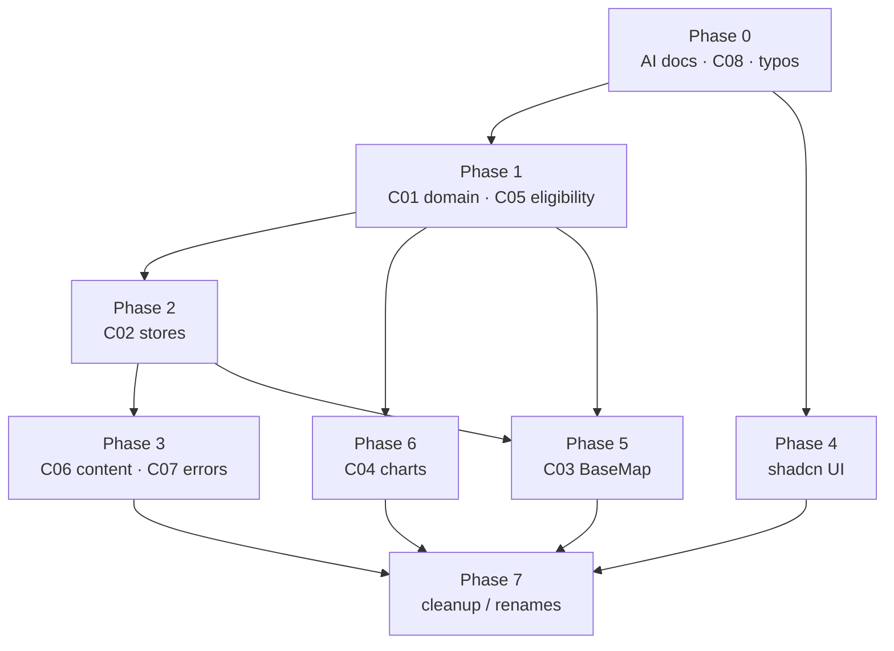

# TFFF Watch — Refactoring Plan

Master index. Four aspects, one synchronized rollout. Each aspect doc is self-contained but shares the **same phase numbers, candidate IDs (C01–C08), and target directory tree** defined here. Read this first.

> **Status:** plan only. No app code changed yet. Production app — every phase ships as its own PR, build green, visual diff checked against `tfffwatch.org_.png`.

## The four aspects

| File | Aspect | Owner concern |
|---|---|---|
| [01-ai-documentation.md](01-ai-documentation.md) | AI / agent docs | `CLAUDE.md`, `AGENTS.md`, `CONTEXT.md`, `docs/adr/` |
| [02-directory-structure.md](02-directory-structure.md) | Directory + naming | folder moves, naming conventions |
| [03-ui-improvements.md](03-ui-improvements.md) | UI primitives | shadcn/ui migration, a11y, dedupe |
| [04-architecture.md](04-architecture.md) | Architecture | C01–C08 deepening (types, stores, maps, charts, fetch) |

## Why one synced plan

The aspects are not independent. Examples:
- Architecture **C01** (one forest-data schema) *creates* the `domain/` folder that the directory plan introduces.
- **C02** (store collapse) *is* the directory plan's "stores → one home" move.
- The UI plan's `cn()` util + `components.json` must land before any shadcn component.
- AI docs (`CONTEXT.md`) must name the domain terms (`CountryForestRecord`, `Eligibility`, `Dataset`) *before* C01 renames code to match them — docs lead, code follows.

So: **one phase order governs all four files.** Doing them out of order causes rework.

## Candidate IDs (from architecture review)

| ID | Title | Strength | Aspect home |
|---|---|---|---|
| C01 | One forest-data schema (branded `Iso2`/`Slug`/`Year`/`Dataset`) | Strong | arch + dir |
| C02 | Collapse 3 stores → 1 `useMapSelection` | Strong | arch + dir |
| C03 | Deep `<BaseMap>` behind 3 maps | Strong | arch |
| C04 | Pure chart transformers + primitives | Strong | arch + ui |
| C05 | `Eligibility` module | Worth exploring | arch + dir |
| C06 | Server-first `content/` data layer | Worth exploring | arch + dir |
| C07 | One error contract | Worth exploring | arch |
| C08 | Re-enable revalidate secret check | Strong (security) | arch |

## Master phase order (governs every aspect)

```
Phase 0  Foundations        AI docs + C08 security + typo renames        no behavior change
Phase 1  Domain             C01 schema + C05 eligibility → domain/        first unit tests
Phase 2  State              C02 store collapse → stores/ consolidation
Phase 3  Data               C06 content/ layer + C07 error contract
Phase 4  UI primitives      shadcn setup → Dialog/Select/Tooltip/Tabs    remove @headlessui
Phase 5  Maps               C03 <BaseMap>
Phase 6  Charts             C04 transforms + DonutChart/ChartTooltip
Phase 7  Cleanup            utils→lib, section folders, data/, fixtures   broad import churn last
```

### Dependency graph



Read: Phase 0 gates everything. Phase 1 (domain types) unblocks state, charts, maps. UI (Phase 4) only needs Phase 0. Cleanup is last because it churns every import path.

## Target directory tree (shared by all docs)

```
src/
  app/                      # routes only; (group-ContainerWidth) → (content)
  domain/                   # NEW — types + pure rules, framework-free   [C01,C05]
    forest-record.types.ts
    country.ts              # merges country-helper + slug-iso2 + mapping
    eligibility.ts          # classify() · colorFor() · legend()
  content/                  # NEW — server fetch layer, wraps api()       [C06,C07]
    news.ts  investment.ts  endorsements.ts  forest.ts
  stores/                   # ALL stores, *.store.ts                      [C02]
    map-selection.store.ts
  lib/                      # was utils/ — generic, domain-free
    http.ts  format.ts  date.ts  env.ts
  components/
    ui/                     # shadcn primitives + project wrappers        [UI]
    layout/
    maps/  { base/ world/ country/ }                                     [C03]
    charts/ { primitives/ transforms/ }                                  [C04]
    sections/ { investment/ endorsement/ tfff/ news/ press/ policies/ }
  data/                     # NEW — *.geo.json, country-mapping.json
public/fixtures/            # richDataExample.json moved OUT of app/
docs/
  refactor/                 # this plan
  adr/                      # decision records                           [AI docs]
CONTEXT.md                  # domain glossary                            [AI docs]
CLAUDE.md / AGENTS.md       # agent instructions                         [AI docs]
```

## Conventions (apply repo-wide)

- Components `PascalCase.tsx`. Domain/lib `kebab-case.ts`. Stores `*.store.ts`. Types `*.types.ts`.
- One store convention, all under `stores/`.
- `className` prop everywhere (drop the `cn=` prop on `Button`/`Container`/`Br`).
- Pure logic (parse, classify, transform) lives outside React → it is the test surface.

## Per-phase exit checklist

Every phase PR must: build passes · typecheck passes · lint passes · new pure modules have unit tests · visual parity vs baseline screenshot · `CONTEXT.md` updated if a domain term was added/renamed.
